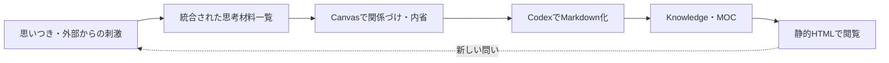

# 自分の考えを整理するワークフロー

## 目的

パッと思い浮かんだ考え、読書・Web・SNSから得た刺激、そこから生まれた自分の反応を一つの流れに乗せ、後から自分の考えを再利用できる状態にする。

理想の流れは次の4段階。

1. 思いついたことを残す
2. 複数の思考材料を一覧し、関係づけたり内省したりする
3. 整理した考えをMarkdownとして定着させる
4. 整理した考えを見やすく一覧できる状態にする



## 基本方針

Reading Note、自分の思いつき、Raindropから取り込んだ情報を、思考時に別々の箱として扱わない。

保存上は区別するが、一覧・検索・Canvasでは同じ「思考材料」として扱う。

区別する軸は次の3つ。

| 軸 | 例 | 意味 |
| --- | --- | --- |
| 起源 | `self / web / book / raindrop` | どこから来たか |
| 構造 | `thought / reading-note / knowledge / moc` | どの形のノートか |
| 状態 | `raw / review / draft / published` | どこまで整理されたか |

Reading Noteは外部情報だけを書くノートではなく、外部の刺激と自分の反応を一緒に残す単位として扱う。

```markdown
## Fragment

外部から得た引用・発言・内容

## My Take

それを見て自分がどう思ったか

## Question

まだ整理できていない疑問
```

## Vault内の役割

- `500_Fleeting`：自分の思いつきや音声入力の一時ログ
- `300_Input`：Web、動画、SNSなどの原資料
- `300_Input/Reading Notes`：一節単位に正規化したReading Note
- `600_Knowledge`：複数の思考材料から整理した自分の考え
- `110_MOC`：KnowledgeやReading Noteをテーマごとに一覧する場所
- `.agent-wiki`：Codexによる候補、クラスタ、MOC案の提案層

## フリーティングの粒度

入力時は一つひとつをファイルに分けず、日次または週次のログに追記する。

```text
思いつき・音声入力
  ↓
日次フリーティングログ
  ↓ 後から分割
独立したthoughtノート
  ↓
KnowledgeまたはMOC
```

目安は次の通り。

- 一文・短い感想：フリーティングログ内に残す
- 独立した主張・観察：`thought`ノートに分ける
- 複数の材料と結びつき、何度も考えたいもの：Knowledge化する

入力時の摩擦を下げるため、「入力時は連ねる、再利用する段階で分ける」を基本とする。

## Canvasの運用

恒久的なCanvasは「一つの問い」ではなく、もう少し抽象的な「一つのテーマ」を単位にする。

### 全体像Canvas

大きなテーマ同士の関係を見るCanvas。

例：

- 生き方
- 他者との関係
- 評価と承認
- 学習と成長

### テーマCanvas

一つのテーマについて、抽象的な概念やMOCを並べるCanvas。

例：「評価と承認」

- 能力主義
- 成果主義
- 自己評価
- 他者からの承認
- まだ整理されていない違和感

### 一時Canvas

具体的なReading Noteやthoughtを並べ、Codexに整理させるための作業場所。

恒久Canvasにすべての断片を置き続けない。カードが増えたら、複数の断片をKnowledgeまたはMOCにまとめ、Canvas上ではその概念カードに置き換える。

Canvasは関係性を見る場所、BaseやHTMLは一覧する場所、Markdownは考えを定着させる場所とする。

## Raindropとの連携

RaindropはWeb情報を保存する場所、Obsidianは考えたり整理したりする場所として分担する。

Raindrop側で `Obsidian` タグを付けた項目だけを、次のスクリプトで `300_Input` に取り込む。

```text
RaindropのObsidianタグ
  ↓
Raindrop API
  ↓
300_InputへMarkdown生成
  ↓
Obsidianで自分の反応を書く
  ↓
Knowledge・MOCへ整理
```

取り込みスクリプト：

```text
scripts/import_raindrop_obsidian_tag.py
```

実行例：

```bash
export RAINDROP_ACCESS_TOKEN="Raindropのアクセストークン"

python3 scripts/import_raindrop_obsidian_tag.py --dry-run
python3 scripts/import_raindrop_obsidian_tag.py
```

既存のInputノートに合わせて、次のfrontmatterを生成する。

```yaml
---
title: ""
source: ""
author:
published:
created: ""
description: ""
tags: []
image:
raindrop_id: ""
---
```

`Obsidian`は取り込み用のトリガーであり、Obsidian側のタグには保存しない。

### RaindropタグとObsidianタグの対応

| Raindropタグ | Obsidianタグ |
| --- | --- |
| `コミュニケーション` | `🎁Topic/Life` |
| `名文` | `🎁Topic/Rhetoric` |
| `例え` | `🎁Topic/Rhetoric` |

対応表にないタグは、原則として次の形式に変換する。

```text
Life → 🎁Topic/Life
```

`Topic/...`や`🎁Topic/...`がすでに付いているタグは、Vaultの形式に合わせて扱う。

## 本文抽出

DefuddleをCLIとしてインストール済み。

```text
/Users/isikurahiromitu/.local/share/mise/installs/node/lts/bin/defuddle
```

取り込みスクリプトはDefuddleが利用可能ならWebページ本文をMarkdownとして抽出する。本文抽出に失敗した場合は、Raindropの説明、ノート、ハイライトを保存する。

## Codexの役割

Codexは自分の考えを代わりに決めるのではなく、選んだ思考材料を整理する編集者として使う。

依頼する内容の例：

- 複数ノートに共通する主張を抽出する
- ノート間の矛盾や反例を指摘する
- 暗黙の前提を言語化する
- まだ答えの出ていない問いを整理する
- Knowledgeノートの初稿を作る

最終的な採用・修正・MOCへの昇格は自分が判断する。

## 今後の実装候補

- `thought`用のフリーティングテンプレートを作る
- `thought`と`reading-note`をまとめて表示するBaseを作る
- CanvasからリンクされたノートをCodex用の入力パケットにする
- `publish: true`のKnowledgeとMOCだけを静的HTML化する
- Raindrop側の取り込み済みタグを自動更新するか検討する

## 関連ノート

- [[読書メモの取り方]]
- [[Obsidian MOCについて]]
- [[010_Topics/PKM]]
